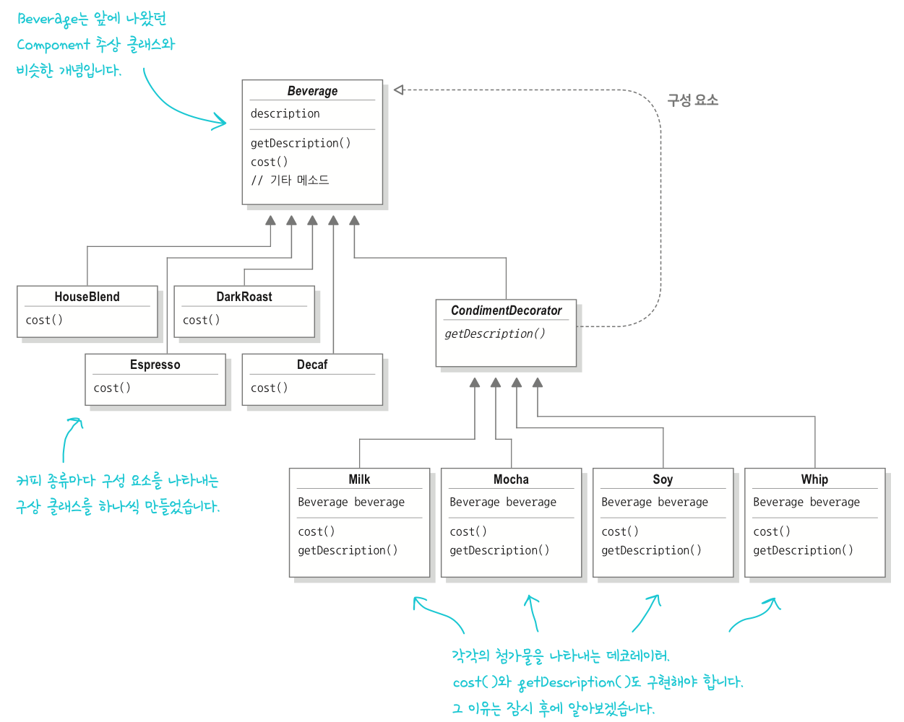

# Decorator Pattern
> 객체에 추가 요소를 동적으로 더할 수 있습니다.  
> 데코레이터를 사용하면 서브클래스를 만들 때보다 훨씬 유연하게 기능을 확장할 수 있습니다.
 ---
### 요구사항
- 스타벅스 주문시스템으로, 기존에는 Beverage 추상클래스를 구현 후, 모든 음료는 이 클래스의 서브클래스로 구현
- `Beverage`에는 1)description(인스턴스 변수), 2)cost()(추상메소드)
  - 이렇게 구현 하니 -> 서브클래스 폭발
- 이후 바뀐 구조
  - `milk`, `soy`, `mocha`, `whip` 등의 첨가물 Boolean 변수 추가
  - 각 음료 인스턴스마다 첨가물에 해당하는 비용까지 포함하도록 추상클래스에서 구현X
  - 각 서브클래스에서는 `cost()`를 오버라이딩 하되, `super.cost()`를 호출함으로써 기본음료 가격에 추가비용을 합친 값을 리턴

-> 위처럼 바뀌어도 문제가 생긴다!
1. 첨가물 가격이 바뀔 떄마다 기존 코드를 수정해야 한다.
2. 첨가물 종류가 많아지면, 새로운 메소드를 추가해야하고, 슈퍼클래스의 cost()도 고쳐야 한다.
3. 새로운 음료 출시 + 특정 첨가물 들어가면 안되는 것 존재
4. 더블 모카 주문시에는?

### 디자인 원칙
> **OCP(Open-Closed Principle)**  
> 클래스는 확장에는 열려있어야 하지만, 변경에는 닫혀있어야 한다.

## 데코레이터 패턴
- 특정 음료에서 시작해서 첨가물로 그 음료를 **장식(decorate)** 하도록
- 예시로, 모카와 휘핑크림을 추가한 다크 로스트 커피를 주문한다면, 
  1) `DarkRoast` 객체를 가져온다.
  2) `Mocha` 객체로 장식한다.
  3) `Whip` 객체로 장식한다.
  4) `cost()` 메소드를 호출한다. 이때, 첨가물의 가격을 계산하는 일은 해당 객체에게 위임한다.
- Mocha, Whip 모두 데코레이터 

### 특징
- 데코레이터의 슈퍼클래스는 자신이 장식하고있는 객체의 슈퍼클래스와 같다.
- 한 객체를 여러개의 데코레이터로 감쌀 수 있다.
- _**데코레이터는 자신이 장식하고 있는 객체에게 어떤 행동을 위임하는 일 말고도 추가작업을 수행할 수 있다.**_
