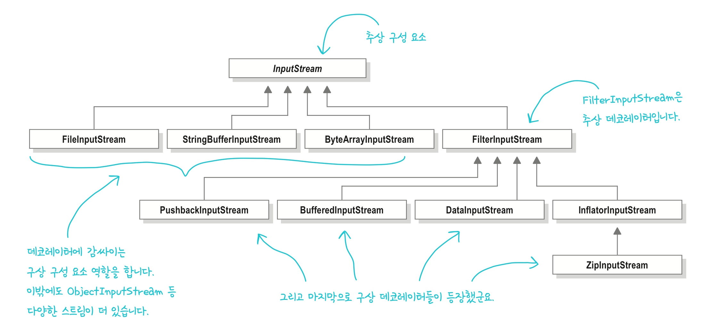

# Decorator Pattern
> 객체에 추가 요소를 동적으로 더할 수 있습니다. <br>
> 데코레이터를 사용하면 서브클래스를 만들 때보다 훨씬 유연하게 기능을 확장할 수 있습니다.
 ---
### 요구사항
- 스타벅스 주문시스템으로, 기존에는 Beverage 추상클래스를 구현 후, 모든 음료는 이 클래스의 서브클래스로 구현
- `Beverage`에는 1)description(인스턴스 변수), 2)cost()(추상메소드)
  - 이렇게 구현 하니 -> 서브클래스 폭발
- 이후 바뀐 구조
  - `milk`, `soy`, `mocha`, `whip` 등의 첨가물 Boolean 변수 추가
  - 각 음료 인스턴스마다 첨가물에 해당하는 비용까지 포함하도록 추상클래스에서 구현X
  - 각 서브클래스에서는 `cost()`를 오버라이딩 하되, `super.cost()`를 호출함으로써 기본음료 가격에 추가비용을 합친 값을 리턴

-> 위처럼 바뀌어도 문제가 생긴다!
1. 첨가물 가격이 바뀔 떄마다 기존 코드를 수정해야 한다.
2. 첨가물 종류가 많아지면, 새로운 메소드를 추가해야하고, 슈퍼클래스의 cost()도 고쳐야 한다.
3. 새로운 음료 출시 + 특정 첨가물 들어가면 안되는 것 존재
4. 더블 모카 주문시에는?

### 디자인 원칙
> **OCP(Open-Closed Principle)** <br>
> 클래스는 확장에는 열려있어야 하지만, 변경에는 닫혀있어야 한다.

## 데코레이터 패턴
- 특정 음료에서 시작해서 첨가물로 그 음료를 **장식(decorate)** 하도록
- 예시로, 모카와 휘핑크림을 추가한 다크 로스트 커피를 주문한다면, 
  1) `DarkRoast` 객체를 가져온다.
  2) `Mocha` 객체로 장식한다.
  3) `Whip` 객체로 장식한다.
  4) `cost()` 메소드를 호출한다. 이때, 첨가물의 가격을 계산하는 일은 해당 객체에게 위임한다.
- Mocha, Whip 모두 데코레이터 


### 특징
- 데코레이터의 슈퍼클래스는 자신이 장식하고있는 객체의 슈퍼클래스와 같다.
- 한 객체를 여러개의 데코레이터로 감쌀 수 있다.
- _**데코레이터는 자신이 장식하고 있는 객체에게 어떤 행동을 위임하는 일 말고도 추가작업을 수행할 수 있다.**_


적용 예시 코드

```java
public abstract class Beverage {
    String description = "제목 없음";
    
    public String getDescription() {
        return description;
    }
    
    public abstract double cost();
}
```
- 음료에 대한 추상클래스 구현 
- 추상클래스 - `getDescription()`, `cost()` 메소드 
  - `getDescription()`는 이미 구현되어있음. 
  - `cost()`는 서브클래스에서 구현해야함.

```java
public abstract class CondimentDecorator extends Beverage {
    Beverage beverage;
    public abstract String getDescription();
}
```
- 데코레이터 역시 추상클래스 구현
- 해당 추상클래스는 `Beverag`(객체 참조), `getDescription()` 추상메소드
  - `Beverage`: 데코레이터가 감쌀 음료를 나타내는 Beverage 객체를 여기서 지정
  - `getDescription()`: 모든 첨가물 데코레이터에 getDescription()메소드 새로 구현해서 만들 예정

```java
public class Espresso extends Beverage {
    public Espresso() {
        description = "에스프레소";
    }
    
    @Override
    public double cost() {
        return 1.99; //에스프레소 가격 리턴
    }
}
```
- Beverage 확장
  - 생성자에서 description 변수값을 설정 : 에스프레소
  - 확장했기에 cost() 오버라이드로 재정의 : 에스프레소 가격 리턴

```java
public class Mocha extends  CondimentDecorator{
    public Mocha(Beverage beverage) {
        this.beverage = beverage;
    }

    @Override
    public String getDescription() {
        return beverage.getDescription() + ", 모카";
    }

    @Override
    public double cost() {
        return beverage.cost() + 0.20;
    }
}
```
- CondimentDecorator 확장한 Mocha(첨가물 == 데코레이터)
  - Beverage는 감싸고자 하는 음료를 저장하는 인스턴스 변수
    - 그것을 객체로 설정하는 생성자
    - 데코레이터의 생성자에 감싸고자 하는 음료 객체를 전달하는 방식을 사용
  - getDescription()를 오버라이드해서 재정의 
    - 설명에 "음료 이름 + 첨가 아이템 이름"(예: 다크 로스트, 모카)로 표기되어야 하기에 더한 값 리턴
  - cost()를 오버라이드해서 재정의
    - 음료 가격에 첨가물 가격 더하여 리턴

```java
public class StarbuzzCoffee {
    public static void main(String[] args) {
        Beverage beverage = new Espresso(); //아무것도 넣지 않은 에스프래소 주문
        System.out.println(beverage.getDescription()
                + " $" + beverage.cost());

        Beverage beverage2 = new DarkRoast(); //DarkRoast객체 만듦
        beverage2 = new Mocha(beverage2); //Mocha로 감싸기
        beverage2 = new Mocha(beverage2); //Mocha로 한번더 감싸기
        beverage2 = new Whip(beverage2); //Whip로 감싸기
        System.out.println(beverage2.getDescription() + " $" + beverage2.cost());
    }
}
```
<출력>
```
에스프레소 $1.99
다크 로스트 커피, 모카, 모카, 휘핑 $1.49
```
### 데코레이터가 적용된 예: 자바I/0
- InputStream이 추상 구성 요소, FilterInputStream은 추상데코레이터, 그리고 그 아래는 구상 데코레이터 임을 알 수 있다!

