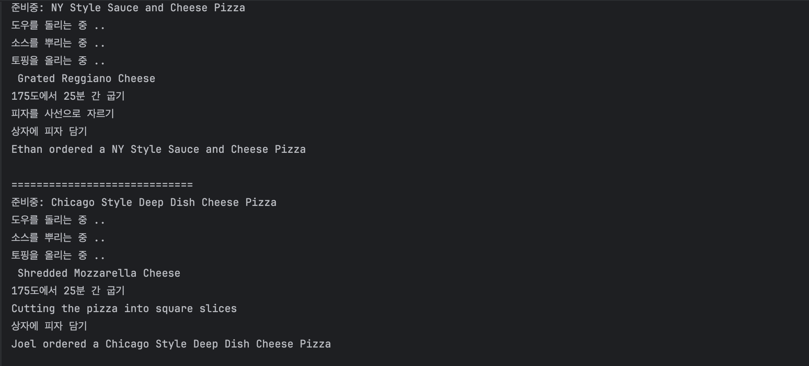

# Factory Pattern
> 팩토리패턴이란?<br>
> 객체를 생성할 때 필요한 인터페이스를 만듭니다.
> 어떤 클래스의 인스턴스를 만들지는 서브클래스에서 결정합니다.
> 팩토리 메소드 패턴을 사용하면 클래스 인스턴스 만드는 일을 서브클래스에서 맡기게 됩니다.

문제 상황:  특정구현을 바탕으로 프로래밍하지 않아야하는 원칙이 있는데, new를 사용하면 구상 클래스의 인스턴스가 만들어지고, 인터페이스가 아닌 특정 구현을 사용한 것 아닌가요?<br>
- 객체지향(=OOP)의 특징 중, 추상화
  - 객체의 속성 중 공통되면서 중요한 성질들만을 추출해서 개략화
  - 실제 구현체는 각각의 서브 클래스에서 구현하도록 맡김
    - **결합도를 낮추고, 코드의 재사용성을 증가시키도록!**
- 설계 단계에 **상속(=extends)** 보다 **복합(=implements)** 를 사용하는 방향
    - 팩토리 패턴은 이러한 상황에서 큰 장점을 지니고 자주 사용된다고 합니담
- 즉, 확장에는 열려 있고 변경에는 닫혀 있어야하는 원칙!

예시 코드 -> 피자가게: 올바른 피자를 고르고, 피자를 만드느 코드를 추가해야한다!

```java
Pizza orderPizza(String type) {
    Pizza pizza;
    
    if(type.equals("cheese")){
        pizza = new CheesePizza();
    } else if (type.equals("greek")){
        pizza = new GreekPizza();
    } else if (type.equals("pepperoni")){
      pizza = new PepperoniPizza();
    }
    
    pizza.prepare();
    pizza.bake();
    pizza.cut();
    pizza.box();
    return pizza;
}
```
- 피자 종류를 바탕으로 올바른 구상 클래스의 인스턴스를 만들고, pizza 인스턴스 변수에 그 인스턴스를 대입!
- 모든 피자 클래스는 Pizza 인터페이스를 구현!

### 위 코드의 문제점
- if ~ else if 문 -> 이 코드에는 변경이 닫혀 있지 않기 때문, 피자 종류가 바뀔 때마다 코드를 계속 고쳐야한다.
  - 인스턴스를 만드는 구상 클래스를 선택하는 부분 : 상황이 변하면 코드를 변경해야해서 
- 아래 피자를 준비하고, 굽고, 자르고 포장하는 일 -> 반드시 있어야하는 일이기 때문에, 이 코드는 고칠 일이 없다! <br>
### 문제의 해결과정
- if문을 피자를 만드는 일만 처리하는 객체에 넣자!
=> **객체 생성 부분 캡슐화** 하자!
- 이 객체 생성을 처리하는 클래스를 "팩토리"!
- SimplePizzaFactory 만들고, 이 클래스는 클라이언트가 받을 피자만 만들도록 구현!

```java
public class PizzaStore {
    SimplePizzaFactory factory;

    public PizzaStore(SimplePizzaFactory factory) {
        this.factory = factory; //PizzaStore의 생성자에 팩토리 객체가 전달
    }
    public Pizza orderPizza(String type) {
        Pizza pizza = factory.createPizza(type);

        pizza.prepare();
        //생략
      
        return pizza;
    }
}
```
```java
public class SimplePizzaFactory {
    public Pizza createPizza(String type) {
        Pizza pizza = null;

        if(type.equals("cheese")){
            pizza = new CheesePizza();
        } else if (type.equals("greek")){
            pizza = new GreekPizza();
        } else if (type.equals("pepperoni")){
            pizza = new PepperoniPizza();
        }

        return pizza;
    }
}
```
- `orderPizza()` 메소드는 팩토리로 피자 객체를 만든다(주문 받을 형식 전달만 하기)
- new 연산자 대신 팩토리 객체에 있는 create 메소드를 써서 더이상 구상 클래스의 인스턴스를 만들 필요가 없음

## 간단한 팩토리
- 디자인패턴이라기 보다는 프로그래밍에서 자주 쓰이는 관용구!느낌이다.
- 아래를 보면 좀더 이해하기가 쉽다!


### 다양한 팩토리 만들기 
- PizzaStore 코드를 모든 지점에서 활용한다
  - `NYPizzaFactory`, `ChicagoPizzaFactory` 와 같이 여러 스타일의 지점별 팩토리를 만든다.
  - `SimplePizzaFactory`를 지우고 `NYPizzaFactory`, `ChicagoPizzaFactory`, `CaliforniaPizzaFactory` 적당한 팩토리를 사용하도록

### 피자 가게 프레임워크 만들기
- 피자 만드는 일 자체를 전부 PizzaStore 클래스에서 진행하면서도 지점별 스타일을 살릴 순 없을까?
- `createPizza()` 메소드를 PizzaStore에 다시 넣고, 이를 추상 메소드로 선언하여 서브클래스를 만들때 이 메소드를 반드시 구현하도록 한다!
  - PizzaStore의 각 서브클래스에서 `createPizza()` 메소드를 오버라이드하지만
  - `orderPizza()` 메소드는 PizzaStore에서 정의한 내용 그대로 사용
    - `orderPizza()` 메소드를 고쳐 쓸 수 없게 하려면 `final`로 선언하면 된다!!!

```java
public static void main(String[] args) {
  PizzaStore nyStore = new NYPizzaStore();
  PizzaStore chicagoStore = new ChicagoPizzaStore();

  Pizza pizza = nyStore.orderPizza("cheese");
  System.out.println("Ethan ordered a " + pizza.getName());
}
```
- 위 코드를 보면, PizzaStore에서 `NYPizzaStore()`를 new하게 된다면, 뉴욕 스타일의 피자가 만들어진다!
- 이를 통해 피자 가게가 확보가 되므로 이제 주문을 받을 떄, 
  - nyPizzaStore 인스턴스의 `orderPizza()` 메소드가 호출 
  - `orderPizza()` 메소드에서 `createPizza()` 메소드를 호출
    - 팩토리 메소드인 `createPizza()` 메소드는 서브클래스에서 구현되고, 이 경우 뉴욕 스타일 치즈피자가 리턴!
    - 이후 `orderPizza()` 메소드 안에 `prepare()`, `bake()`, `cut()`, `box()` 정의된 것을 출력한다!
      - 여기서 중요한 점은 이 피자 객체가 어느 구상 클래스의 객체인지 전혀 알지못함!!
- 코드가 이렇게 출력됨을 알수 있다!



## 팩토리 패턴
- Creator 추상 클래스에서 객체를 만드는 메소드 -> 팩토리 메소드 용 인터페이스를 제공
- Creator 추상 클래스에 구현되어 있는 다른 메소드는 팩토리 메소드에 의해 생산된 제품으로 필요한 작업을 처리
  - 실제 팩토리 메소드를 구현하고 제품(객체 인스턴스)을 만드는 일은 서브클래스에서만 할 수 있음
  - **어떤 클래스의 인스턴스를 만들지를 서브클래스에서 결정한다** 

> 사용하는 서브클래스에 따라 생산되는 객체 인스턴스가 결정

## 디자인 원칙 - 의존성 뒤집기 원칙
> 추상화된 것에 의존하게 만들고 구상 클래스에 의존하지 않게 만든다.
> 고수준 구성 요소가 저수준 구성 요소에 의존하면 안되며, 항상 추상화에 의존하게 만들어야 한다는 뜻!
- PizzaStore: 고수준 구성 요소
- Pizza 클래스 : 저수준 구성 요소

### 의존성 뒤집기 원칙 적용하기
- 문제점: PizzaStore가 모든 종류의 피자에 의존한다는 점, orderPizza() 메소드에서 구상 형식의 인스턴스를 직접 만들었기 때문
- 해결된 다이어그램
  - PizzaStore -> Pizza 에만의존
  - NYStyleCheesePizza, NYStylePepperoniPizza -> Pizza

### 의존성 뒤집기 원칙을 지키는 방법
- 변수에 구상 클래스의 레퍼런스를 저장하지 말자.
  - new 연산자를 사용하면 구상 클래스의 레퍼런스를 사용하게 되니, 팩토리를 써서 구상 클래스의 레퍼런스 변수에 저장하는 일을 미리 방지하자.
- 구상 클래스에서 유도된 클래스를 만들지 말자.
  - 구상 클래스에서 유도된 클래스를 만들면 특정 구상 클래스에 의존하게 되니, 인터페이스나 추상 클래스처럼 추상화된 것으로부터 클래스를 만들어야한다.
- 베이스 클래스에 의미 구현되어 있는 메소드를 오버라이드 하지 말자.
  - 이미 구현된 메소드르 오버라이드 한다면 베이스 클래스가 제대로 추상화되지 않는다, 베이스 클래스에서 메소드를 정의할 때는 모든 서브 클래스에서 공유할 있는 것만 정의해야한다.