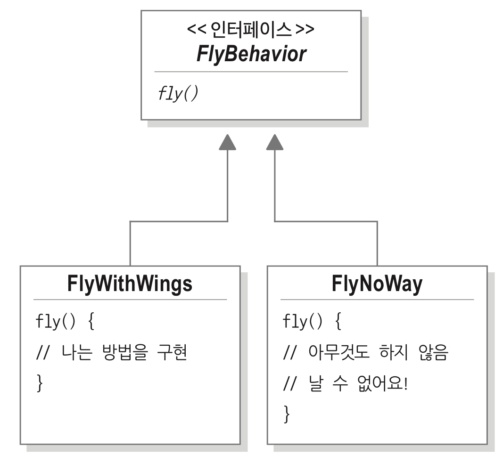

# DESIGN PATTERNS
 ___
### 디자인 원칙1 
> 애플리케이션에서 달라지는 부분을 찾아내고, 달라지지 않는 부분과 분리한다.
- 달라지는 부분을 찾아서 나머지 코드에 영향을 주지 않도록 **캡슐화** 
- 나중에 바뀌지 않는 부분에는 영향을 미치지 않고, 그 부분만 고치거나 확장 가능
- 예시,
    * Duck - `fly()`, `quack()`
    * Duck 클래스는 변화하지 않고, 그 안의 행동들이 변화는 부분임을 인지
    * `fly()`: 나는 행동, `quack()`: 꽥꽥거리는 행동 - 별도의 클래스 집합으로 분리하자.

### 디자인 원칙2
> 구현보다는 인터페이스에 맞춰서 프로그래밍한다. 
*== 상위 형식에 맞춰서 프로그랭한다*
- 각 행동을 인터페이스로 표현후, 인터페이스를 사용하여 행동을 구현
  * FlyBehavior, QuackBehavior
- Duck의 행동이 별도의 클래스 안에 들어있기에 -> Duck 클래스에서는 그 행동을 구체적으로 구현할 필요가 X

### 디자인 원칙3
> 상속보다는 구성을 활용한다.

