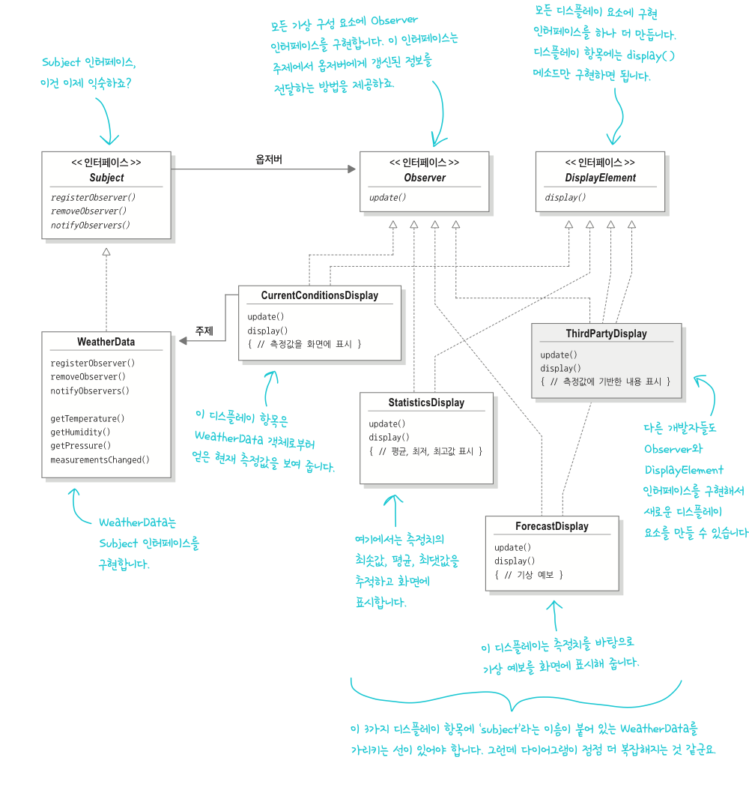
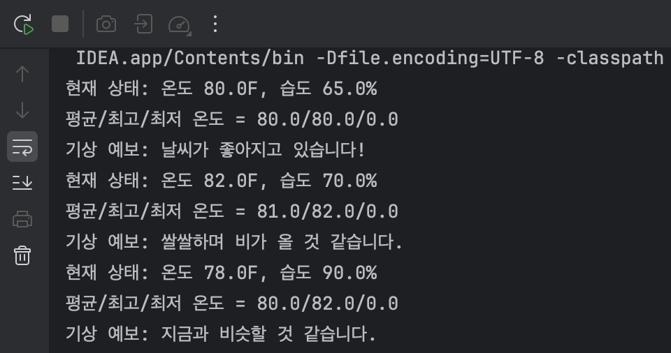

# Observer Pattern
> 한 객체의 상태가 바뀌면 그 객체에 의존하는 다른 객체에게 연락이 가고 자동으로 내용이 갱신되는 방식으로 일대다(one-to-many) 의존성을 정의합니다.
---
### 요구사항
- weatherData 클래스에는 3가지 측정값(온도, 습도, 기압)의 게터메소드 있음
- 새로운 기상 측정 데이터가 들어올 떄마다 measurementsChanged() 메소드가 호출됨
- 디스플레이는 3가지로 구현되는데 현재 조건 디스플레이, 기상 통계 디스플레이, 기상 예보 디스플레이
- 미래에 디스플레이가 추가 되는 것까지 고려하여 구현해야함.

``` java
public class WeatherData {
    //인스턴스 변수 선언

    public void measurementsChanged() {
        float temp = getTemperature(); //게터메소드 호출로 최신 측정값 가져온 후 적당한 변수에 저장
        float humidity = getHumidity();
        float pressure = getPressure();

        //각 디스플레이 갱신
        currentConditionsDisplay.update(temp, humidity, pressure);
        statisticsDisplay.update(temp, humidity, pressure);
        forecastDisplay.update(temp, humidity, pressure);
    }
}
```
* 위 코드의 문제점 
  1) 각 디스플레이 부분은 구체적인 구현에 맞춰 코딩하였기 때문에 프로그램을 고치지 않고는 다른 디스플레이 항목을 추가하거나 제거할 수 없다.
  2) `update(temp, humidity, pressure)` 이 부분들은 바뀔 수 있는 부분이기 때문에 캡슐화 해야한다.
     <br> => 즉, 변화가 일어났을떄 (== 실행 중에 디스플레이를 더하거나 빼려면)  어떻게 해야할지!

## 옵저버 패턴
- 예시로, 신문사와 구독자로 비유 가능
- 신문사: 주제자(subject) 
  - 상태를 저장하고 있는 객체 (중요한 데이터를 저장하고 있음)
  - 주제의 상태가 바뀌면 옵저버에게 정보 전달
- 구독자: 옵저버(observer)
  - 딸린 객체로 주제를 구독하고 있음(주제 객체에 등록되어 있음)
  - 주제의 상태 바뀌면 정보를 전달 받음
  
``` java
public interface Subject {
    void registerObserver();
    void removeObserver();
    void notifyObserver();
}
```
- 주제를 나타내는 Subject 인터페이스
- 객체에서 옵저버로 등록하거나 옵저버 목록에서 탈퇴하고 싶을 때는 이 인터페이스의 메소드 사용

``` java
public interface Observer {
    void update();
}
```
- 옵저버가 될 가능성 있는 객체는 반드시 Observer 인터페이스를 구현해야함.
- 주제의 상태가 바뀌었을 때 호출되는 update() 메소드만 존재.

``` java
public class ConcreteSubject {
    void registerObserver(){ ... };
    void removeObserver(){ ... };
    void notifyObserver(){ ... };
    
    getState();
    setState();
}
```
- 구체적인 주제역할의 구상 클래스 : 반드시 인터페이스를 구현
- 주제 등록/해지용 메소드, 그리고 상태 바뀔 때마다 모든 옵저버에게 연락하는 메소드 구현
- 상태 설정 및 가져오는 게터/세터 메소드도 존재 할 수 있음
``` jsva
public class ConcreteObserver {
    void update() {
    //기타 옵저버용 메소드
    }
}
```
- Observer 인터페이스만 구현하면 누구나 옵저버 클래스 될 수 있음

### 느슨한 결합이란?
> 객체들이 상호작용할 수는 있지만, 서로 잘 모르는 관계 => 유연성 아주 좋음
" 옵저버 패턴 " 은 느슨한 결합의 좋은 예!

1. 주제는 옵저버가 특정 인터페이스(Observer 인터페이스)를 구현한다는 사실"만" 알고 있음
   - 옵저버의 구상클래스가 무엇인지, 옵저버가 무엇을 하는지 전혀 모름
2. 옵저버는 언제든지 새로 추가할 수 있음
   -  주제는 Observer 인터페이스를 구현하는 **객체의 목록**에만 의존하기 때문에 언제든 추가 가능
3. 새로운 형식의 옵저버를 추가할 떄도 주제를 변경할 필요가 없음
   - 새로운 클래스에서 1)Observer 인터페이스 구현, 2) 옵저버로 등록 -> 주제는 전혀 신경쓸 필요가 없음
4. 주제와 옵저버는 서로 독립적으로 재사용 가능 (서로 느슨한 결합)
5. 주제나 옵저버가 달라져도 서로에게 영향을 미치지 않음

### 디자인 원칙 4
> 상호작용하는 객체 사이는 가능하면 느슨한 결합을 사용해야 한다.

---
- 옵저버 패턴을 알고 난 후?
  - WeatherData 클래스가 '일(one)', 디스플레이 요소 '다(many)'
  - WeatherData: 주제, 디스플레이 요소들: 옵저버
  - 모든 디스플레이 요소 다름 -> 측정값을 받는 공통 인터페이스 구현 == update() 메소드가 공통 인터페이스에 존재해야함
  - 구성 요소 형식이 달라도 모두 똑같은 인터페이스를 구현해야, WeatherData 객체에서 측정값을 보낼 수 있음.

### 기상 스테이션 설계


코드로는 `CurrentConditionsDisplay`, `ForecastDisplay`, `StatisticsDisplay` 모두 구현을 한 상태이지만, 예시로 하나만 설명해보고 넘어가려고 한다.
```java
public class CurrentConditionsDisplay implements Observer, DisplayElement {
    //Observer: Weather 객체로부터 변경 사항을 받으려면 구현
    //Displayment: 모든 디스플레이  항목에서 구현해야함
    private float temperature;
    private float humidity;
    private WeatherData weatherData;

    //생성자 - WeatherData 주제가 전달되며 그 객체를 써서 디스플레이에 옵저버로 등록
    public CurrentConditionsDisplay(WeatherData weatherData) {
        this.weatherData = weatherData;
        weatherData.registerObserver(this);
    }

    @Override
    public void update(float temp, float humidity, float pressure) { //update()가 호출되면 온도와 습도를 저장하고 display()를 호출
        this.temperature = temp;
        this.humidity = humidity;
        display();
    }

    @Override
    public void display() { //가장 최근에 받은 온도와 습도 출력
        System.out.println("현재 상태: 온도 " + temperature + "F, 습도 " + humidity + "%");
    }
}

```
- `Observer`에 구현되어있는 `update()` 중 해당 디스플레이에 피룡한 부분만 오버라이드 한다.
- `DisplayElement`에 구현되어있는 `display()`를 각 디스플레이에 맞게 구현하기 위해 오버라이드한다.
- `CurrentConditionsDisplay`에 필요한 변수를 쓰고, `WeatherData`를 받아서 옵저버로 등록하도록 생성자를 구현한다.
- `update()` 메서드를 씀과 동시에 화면에 보여지는 `display()`를 호출하여 출력한다.
- 각 디스플레이마다, 어떤 방법으로 업데이트 되어지는 각 클래스에서 구현하며, `display()` 또한 마찬가지이다.

<WeatherStation - Main>
```java
public class WeatherStation {
    public static void main(String[] args) {
        WeatherData weatherData = new WeatherData();

        CurrentConditionsDisplay currentConditionsDisplay = new CurrentConditionsDisplay(weatherData);
        StatisticsDisplay statisticsDisplay = new StatisticsDisplay(weatherData);
        ForecastDisplay forecastDisplay = new ForecastDisplay(weatherData);

        weatherData.setMeasurements(80, 65, 30.4f);
        weatherData.setMeasurements(82, 70, 29.2f);
        weatherData.setMeasurements(78, 90, 29.2f);
    }
}
```

결과가 잘 나옴을 알 수 있당 !
