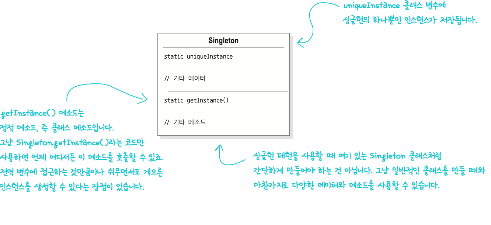
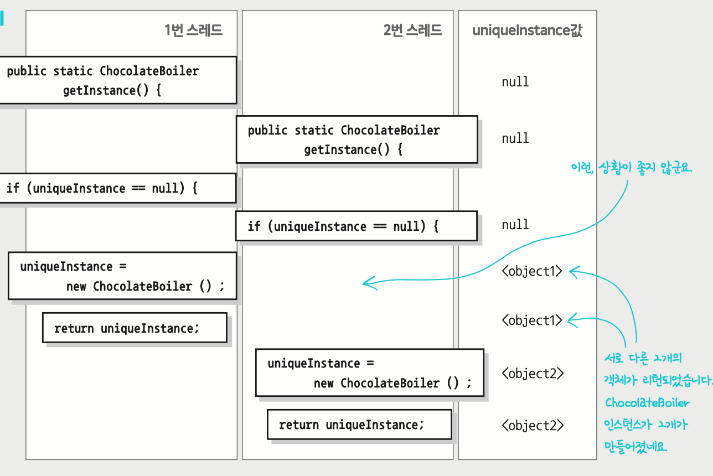

# Singleton Pattern
> 클래스 인스턴스를 하나만 만들고, 그 인스턴스로의 전역 접근을 제공합니다.

- 싱글턴 패턴이란 - _특정 클래스에 객체 인스턴스가 하나만 만들어지도록 해주는 패턴_
  - 전역 변수를 사용할 때와 마찬가지로 객체 인스턴스를 어디서든 액세스할 수 있게 만들 수 있으며, 전역 변수를 쓸 때처럼 단점을 감수할 수 있다!
- 그렇다면, 전역 변수에는 어떤 단점이?
  - 전역 변수에 객체를 대입하고 객체를 생성되고, 이 객체가 **애플리케이션이 끝날 때까지 한번도 사용하지 않는다면** 자원만 잡아먹는 쓸모없는 객체!

=> 싱글턴 패턴을 잘 사용하면 필요할 때만 객체를 만들 수 있다!!

## 고전적인 싱글턴 패턴 구현법

```java
public class Singleton {
    private static Singleton uniqueInstance; 
    //기타 인스턴스 변수
    
    private Singleton {}
    
    public static Singleton getInstance() {
        if (uniqueInstance == null) {
            uniqueInstance = new Singleton();
        }
        return uniqueInstance;
    }
    
    //기타 메소드
}
```
- uniqueInstance - Singleton 클래스의 하나뿐인 인스턴스를 저장하는 정적 변수
- 생성자 - private으로 선언했기 때문에 Singleton에서만 클래스의 인스턴스를 만들 수 있음
- getInstance() 메소드 - 클래스의 인스턴스를 만들어서 리턴
  - uniqueInstance에 하나뿐인 인스턴스가 저장되기에, null 확인으로 아직 인스턴스가 생성되지 않음을 알 수 있음
  - 이렇게 된다면, 인스턴스가 필요한 상황이 닥치기 전까지 아예 인스턴스를 생성하지 않음
  - 게으른 인스턴스 생성(lazyinstatiation)

### 초콜릿 보일러 코드
```java
public class ChocolateBoiler {
    private boolean empty;
    private boolean boiled;

    private ChocolateBoiler() { 
        empty = true;
        boiled = false;
    }

    public void fill(){
        if (isEmpty()){
            //보일러가 비었을 때만 재료를 넣음
            empty = false;
            boiled = false;
        }
    }

    public void drain(){
        if (!isEmpty() && isBoiled()){
            //보일러가 비어 있지 않고, 다 끓여진 상태에서만 
            //보일러에 들어있는 재료를 다음 단계로 넘김
            empty = true;
        }
    }

    public void boil(){
        if (!isEmpty() && !isBoiled()){
            //보일러가 가득 차있고, 아직 끓지 않은 상태에서만 재료를 끓임
            //재료를 다 끓이면 boiled 플래그를 true로 설정
            boiled = true;
        }
    }

    public boolean isEmpty() {
        return empty;
    }

    public boolean isBoiled() {
        return boiled;
    }
}

```

### 싱글턴으로 업그레이드 해보기
```java
private static ChocolateBoiler uniqueInstance;
public static ChocolateBoiler getInstance() { 
    if (uniqueInstance == null) {
  uniqueInstance = new ChocolateBoiler(); 
    }
  return uniqueInstance; 
}
```
- 인스턴스 변수 생성하기
- 변수가 null인지 확인하고 객체 생성하기 => 하나만을 생성할 수 있다!

## 싱글톤 패턴 정의
> 클래스에서 하나뿐인 인스턴스를 관리하도록 만들기
> 다른 어떤 클래스에서도 자신의 인스턴스를 추가로 만들지 못하도록한다! (인스턴스가 필요하다면, 반드시 클래스 자신을 거치도록)
> 이 인스턴스를 접근할 . 있도록 전역 접근 지점을 제공

<클래스 다이어그램>


### 멀티스레딩 문제 발생
```
ChocolateBoiler boiler = ChocolateBoiler.getInstance();
boiler.fill(); 
boiler.boil(); 
boiler.drain();
```
- 위 코드를 2개의 스레드에서 실행한다고 가정한다면, 두 스레드가 다른 보일러 객체를 사용하게 될 가능성은 정말 없을까?

- null 체크 이후 서로 다른 2개의 객체가 리턴되면서, 결국 ChocolateBoiler 인스턴스가 2개 생성되어버렸다!

### 멀티스레딩 문제 해결
```java
public static synchronized Singleton getInstance() { 
    if (uniqueInstance == null) {
        uniqueInstance = new Singleton(); 
    }
    return uniqueInstance; 
}
```
- synchronized를 추가한다면, 한 스레드가 메소드 사용 끝내기 전까지 다른 스레드를 기다리도록!
  - 그렇다면, 여기서의 문제는 동기화할 때 속도 문제가 생기진 않을까..?

### 더 효율적으로 멀티스레딩 문제 해결
1) getInstance()의 속도가 그렇게 중요하지 않다면 그냥 두자!
2) 인스턴스를 필요할 때는 생성하지 말고 처음부터 만들자! 
```java
public class Singleton { 
    private static Singleton uniqueInstance = new Singleton();

    private Singleton() {}
  
    public static Singleton getInstance() {
        return uniqueInstance;
    } 
}
```
  - 정적 초기화 부분에서 Singleton의 인스턴스를 생성해버림
  - 인스턴스 이미 있으니까 `getInstane()`에서 그대로 리턴
3) DCL 을 써서 getInstane()에서 동기화되는 부분을 줄이자!
 - DCL (Double-Checked Locking) 이란?
   - 인스턴스가 생성되어 있는지 확인한 다음 생성되지 않았을 때만 동기화 가능
   - 이렇게 되면, 처음에만 동기화하고 나중에는 동기화하지 않아도 된다!
```java
public class Singleton { 
    private volatile static Singleton uniqueInstance;
    private Singleton() {}
  public static Singleton getInstance() {
        if (uniqueInstance == null) { 
            synchronized (Singleton.class) {
                if (uniqueInstance == null) { 
                    uniqueInstance = new Singleton();
                } 
            }
        }
        return uniqueInstance; 
    }
}
```
- enum을 사용하면 여러 동기화문제, 클래스 로딩 문제, 리플렉션 등 해결할 수 있다!
- 예시코드
```java
public enum Singleton { 
    UNIQUE_INSTANCE;
}
public class SingletonClient {
    public static void main(String[] args) {
        Singleton singleton = Singleton.UNIQUE_INSTANCE;
        //여기서 싱글턴 사용
    }
}
```